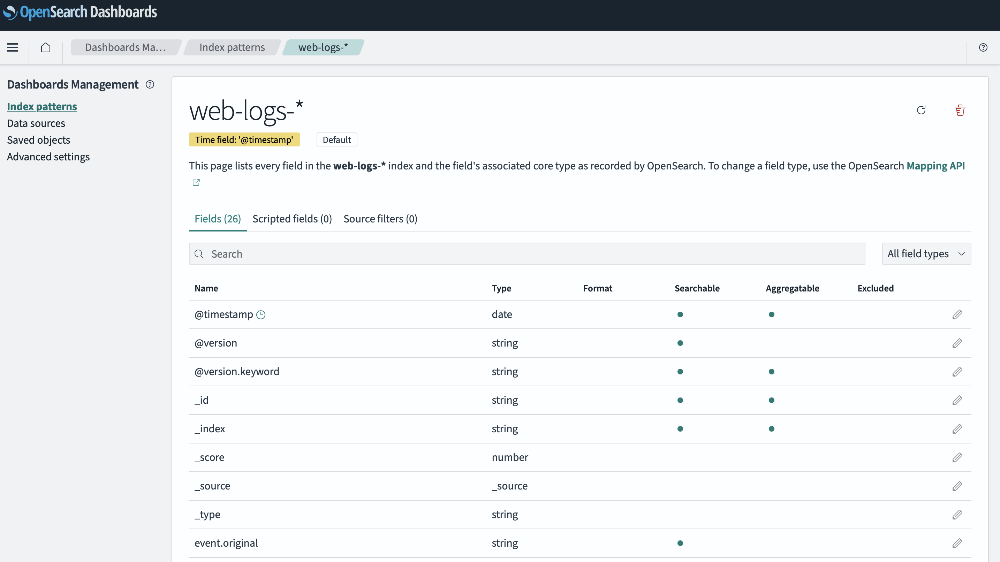
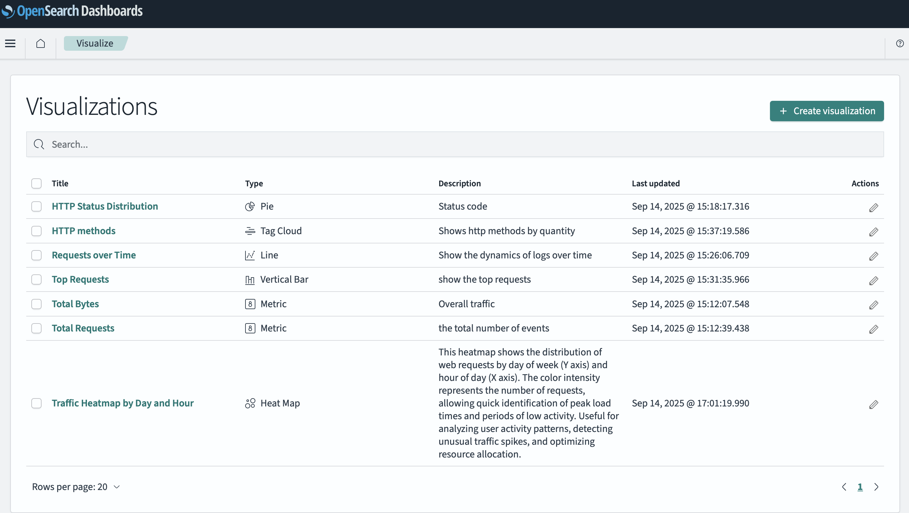
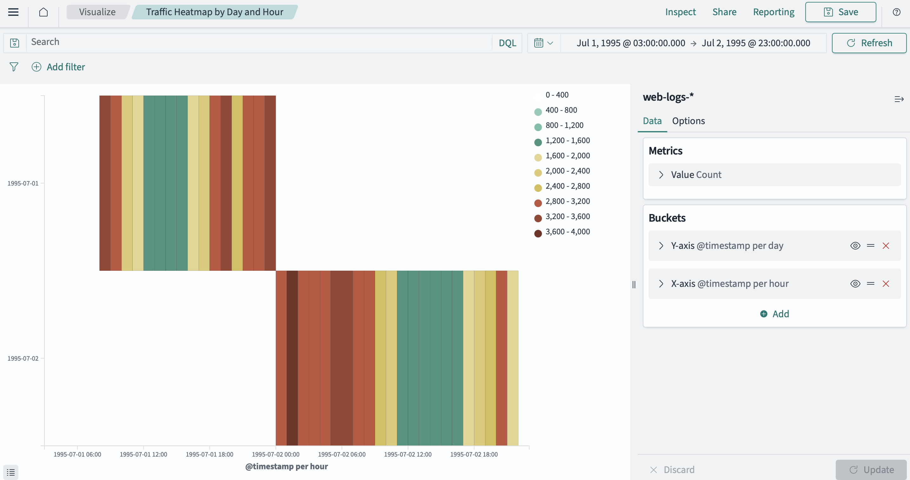
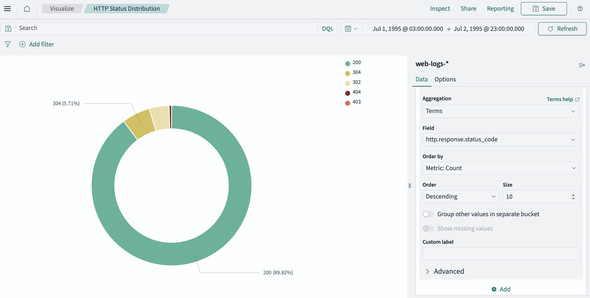
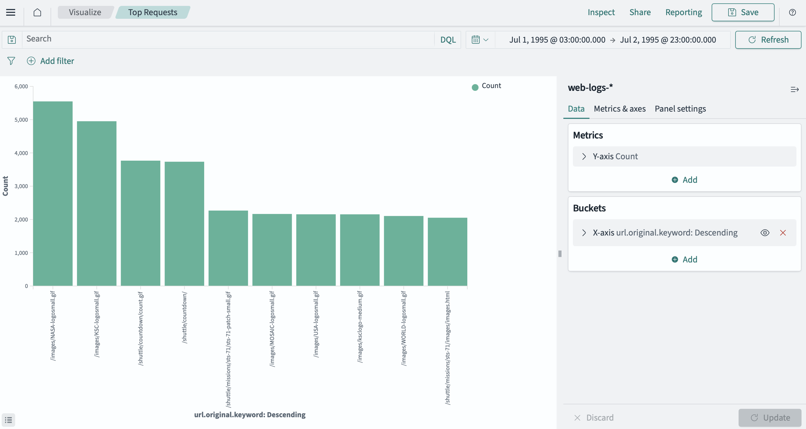
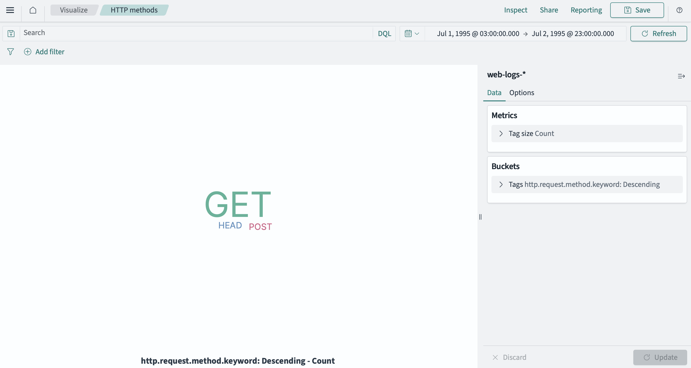
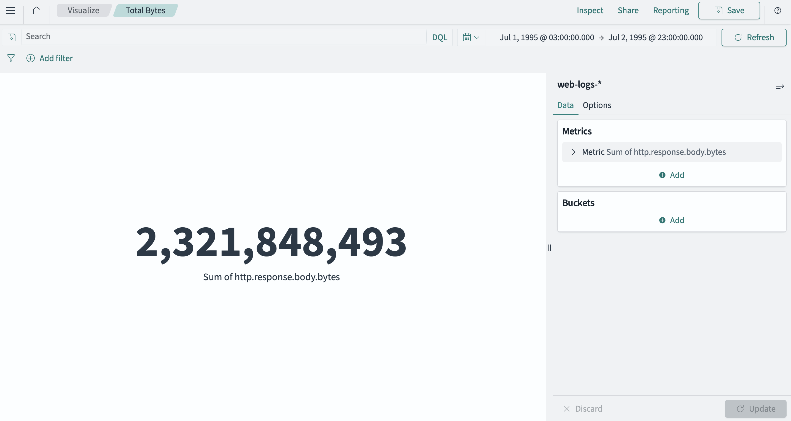
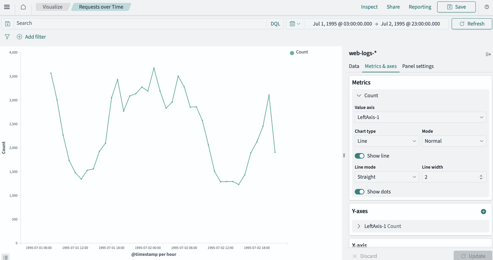
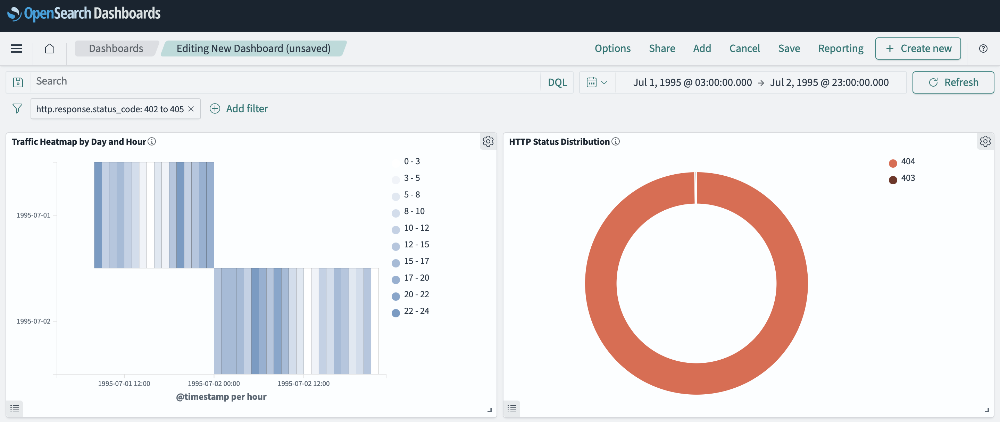
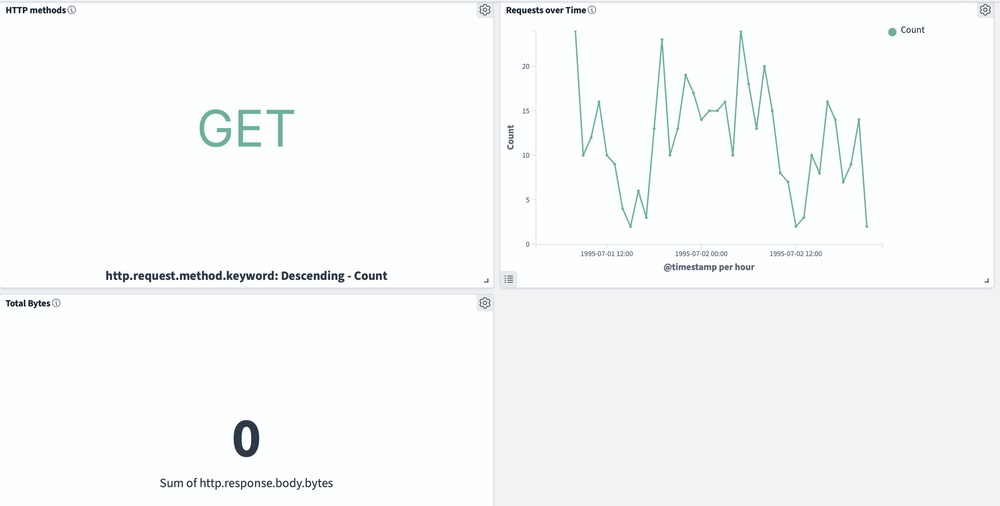

# Настройка стека OpenSearch для анализа логов

Этот проект содержит конфигурацию для развертывания стека OpenSearch, Logstash и OpenSearch Dashboards с помощью Docker Compose. Система предназначена для сбора, обработки, индексации и визуализации логов.

## Состав стека

1.   **OpenSearch** — поисковый и аналитический движок для хранения и индексации данных.
2.   **OpenSearch Dashboards** — веб-интерфейс для визуализации и анализа данных из OpenSearch.
3.   **Logstash** — серверный конвейер обработки данных для приема, преобразования и отправки данных в OpenSearch.

## Структура проекта
```
opensearch-test/
├── 📄 docker-compose.yml
├── 📖 README.md
└── 📁 logstash/
    ├── 📁 pipeline/
    │   └── ⚙️ logstash.conf
    └── 📁 data/
        └── 📊 access_log_Jul95.txt
```

## Конфигурация

### Docker Compose

Файл `docker-compose.yml` определяет три сервиса, связанные через сеть `palp`:

—   **opensearch-server**, который доступен на портах `9200` (HTTP REST API) и `9300` (Transport).
—   **opensearch-dashboards**, который доступен на порту `5601`.
—   **logstash**, который настроен на монтирование папок `pipeline` и `data` для гибкой конфигурации.

### Logstash Pipeline

Пайплайн в `logstash/pipeline/logstash.conf` настроен на:
1.   **Input**. Чтение из файла `access.log` в смонтированной директории `data`.
2.   **Filter**. Парсинг логов с помощью Grok-паттерна для извлечения полей (client, method, status, timestamp и т.д.).
3.   **Output**. Отправка структурированных данных в OpenSearch для индексации в индекс `access-logs`.


# Отчёт по настройке OpenSearch, Logstash и OpenSearch Dashboards

## 1. Установка и запуск OpenSearch

На первом этапе для знакомства с системой был произведен запуск контейнера OpenSearch в ручном режиме с использованием команды docker run:

```bash
docker run -d \
  --name opensearch-server \
  -p 9200:9200 \
  -p 9300:9300 \
  --network palp \
  -v opensearch_data:/bitnami/opensearch \
  bitnami/opensearch:latest
```
Этот способ позволил мне проверить корректность работы сервиса и убедиться в доступности основных портов (9200 — для REST API, 9300 — для внутреннего взаимодействия). Однако ручной запуск показался достаточно неудобным для дальнейшей интеграции и масштабирования, поэтому было я решил перейти на использование `docker-compose.yml`, что обеспечило удобство управления сервисами и их взаимосвязями.

Выбран следующий датасет: https://www.kaggle.com/datasets/sanjeevsahu/web-log-access-dataset

Укажу причину в виде примера строки:
199.227.6.10 - - [01/Jul/1995:21:57:07 -0400] "GET /... HTTP/1.0" 200 3092
соответствует структуре CLF: %h %l %u %t "%r" %>s %b.
 


## Создание конфигурации (docker-compose.yml)

Финальная версия инфраструктуры была реализована через `docker-compose.yml`, включающую три сервиса: OpenSearch, OpenSearch Dashboards и Logstash.

```yml
services:
  opensearch-server:
    image: bitnami/opensearch:latest
    container_name: opensearch-server
    ports:
      - "9200:9200"
      - "9300:9300"
    networks:
      - palp
    volumes:
      - opensearch_data:/bitnami/opensearch

  opensearch-dashboards:
    image: bitnami/opensearch-dashboards:latest
    container_name: opensearch-dashboards
    ports:
      - "5601:5601"
    environment:
      - OPENSEARCH_DASHBOARDS_OPENSEARCH_URL=http://opensearch-server:9200
    networks:
      - palp
    depends_on:
      - opensearch-server

  logstash:
    image: opensearchproject/logstash-oss-with-opensearch-output-plugin:latest
    container_name: logstash
    networks:
      - palp
    volumes:
      - /Users/ratiborpoleshko/opensearch-test/logstash/pipeline:/usr/share/logstash/pipeline
      - /Users/ratiborpoleshko/opensearch-test/logstash/data:/usr/share/logstash/data
    depends_on:
      - opensearch-server

volumes:
  opensearch_data:

networks:
  palp:
    driver: bridge
```


## 3. Настройка Logstash

Для загрузки данных в OpenSearch был настроен Logstash, получающий логи из файлов (`pipeline/logstash.conf`):

```conf
input {
  file {
    path => "/usr/share/logstash/data/access_log_jul95.txt"
    start_position => "beginning"
    sincedb_path => "/dev/null"
    codec => plain { charset => "UTF-8" }
  }
}

filter {
  # Парсим CLF стандартным COMMONAPACHELOG
  grok {
    match => { "message" => "%{COMMONAPACHELOG}" }
  }

  # Преобразуем timestamp в @timestamp
  date {
    match => [ "timestamp", "dd/MMM/yyyy:HH:mm:ss Z" ]
    target => "@timestamp"
    remove_field => ["timestamp"]
  }

  # bytes может быть "-" в некоторых логах — заменим на 0 перед конвертацией
  if [bytes] == "-" {
    mutate { replace => { "bytes" => "0" } }
  }

  # Попробуем разбить request на method и request_path + httpversion 
  if [request] {
    grok {
      match => { "request" => "%{WORD:method} %{NOTSPACE:request_path}(?: HTTP/%{NUMBER:httpversion})?" }
      # не ломаем основную схему при ошибке
      break_on_match => false
    }
  }

  mutate {
    convert => {
      "response" => "integer"
      "bytes"    => "integer"
    }
    # добавим значение по умолчанию для httpversion если не найдено
    add_field => { "httpversion" => "%{httpversion}" }
  }

  # удаляем служебные поля
  mutate { remove_field => ["tags","message"] }
}

output {
  opensearch {
    hosts => ["http://opensearch-server:9200"]
    user => "admin"
    password => "admin"
    index => "web-logs-%{+YYYY.MM.dd}"
   
    # template_overwrite => false
  }
  stdout { codec => rubydebug }
}
```
Логи из директории data автоматически обрабатываются и индексируются в OpenSearch.


## 4. Визуализация данных в OpenSearch Dashboards
Для анализа логов в OpenSearch Dashboards был создан Index Pattern, после чего подготовлен ряд визуализаций:
1.	Metric – общее количество событий (счётчик);
2.	Pie chart – распределение HTTP-статусов (200, 302, 304, 403, 404) по количеству запросов;
3.	Vertical bar – количество запросов по часам;
4.	Line – динамика запросов во времени;
5.	Vertical bar – наиболее часто запрашиваемые ресурсы на сервере;
6.	Heatmap – тепловая карта нагрузки на сервис (распределение запросов по часам и дням недели);
7.	Tag cloud — визуализация частоты использования HTTP-методов.

<div align="center">В начале я создал Index Pattern:</div>
<div align="center">
  
  <p><em>Создание Index Pattern</em></p>
</div>

<div align="center">После этого были созданы следующие визуализации:</div>
<div align="center">
  
  <p><em>Все визуализации</em></p>
</div>

<div align="center">В результаты получилось следующее:</div>

<div align="center">
  
  <p><em>Тепловая карта нагрузки на сервис (распределение запросов по часам и дням недели)</em></p>
</div>

<div align="center">
  
  <p><em>Распределение HTTP-статусов (200, 302, 304, 403, 404) по количеству запросов</em></p>
</div>

<div align="center">
  
  <p><em>Наиболее часто запрашиваемые ресурсы на сервере</em></p>
</div>

<div align="center">
  
  <p><em>Облако тегов: визуализация частоты использования HTTP-методов</em></p>
</div>

<div align="center">
  
  <p><em>Счётчик общего количества обработанных запросов</em></p>
</div>

<div align="center">
  
  <p><em>Общий объём переданных данных в байтах</em></p>
</div>

<div align="center">
  
  <p><em>Динамика количества запросов во времени (линейный график)</em></p>
</div>


Далее я сформировал **Dashboard** для комплексного анализа данных.  
Для наглядности в качестве примера был выставлен фильтр `http.response.status_code: 402 to 405`, чтобы сосредоточиться на ошибочных запросах.  
В логах это в первую очередь касалось кодов **403 (Forbidden)** и **404 (Not Found)**.  

- 403 (Forbidden) означает, что доступ к запрашиваемому ресурсу запрещён, даже если сам ресурс существует.  
- 404 (Not Found) указывает на то, что ресурс не найден на сервере.  

<div align="center">
  
  
  
  <p><em>Дашборд с фильтром по ошибочным HTTP-кодам (403 и 404)</em></p>
</div>


## 5. Возникшие проблемы и их решение в процессе выполнения тестового задания

### Проблема с сетью контейнеров
На раннем этапе я столкнулся с тем, что контейнеры не создавались в одной сети. В результате сервисы не «видели» друг друга, и приходилось вручную указывать параметры подключения. Причина оказалась в том, что я запускал контейнеры в разных сетях, а OpenSearch Dashboards и Logstash требовали подключения к `opensearch-server`, который находился в сети `palp`.  

После нескольких неудачных попыток я понял, что гораздо удобнее и надёжнее будет объединить инфраструктуру в одном `docker-compose.yml`. Это позволило запускать весь стек одной командой:  
```bash
docker compose up -d
```
С этого момента всё стало выглядеть гораздо более структурировано, а работа сервисов стабилизировалась:


#### Проблема с кодировкой на MacOs
Вторая серьёзная проблема оказалась достаточно неожиданной. При вызове `docker logs -f logstash` конфигурационного файла `logstash.conf` у меня не формировались логи. Logstash отказывался парсить файл, и я потратил существенное количество времени на то, чтобы локализовать проблему.
Оказалось, что **TextEdit** сохранял файл в неподходящей кодировке, и Logstash просто не воспринимал его корректно. Решение пришло в несколько этапов:

**1. Конвертация в UTF-8 с помощью iconv:**
```bash
iconv -f us-ascii -t utf-8 logstash/pipeline/logstash.conf > logstash/pipeline/logstash.conf.new
mv logstash/pipeline/logstash.conf.new logstash/pipeline/logstash.conf
```
**2. Проверка окончания строк (должны быть LF, а не CRLF):**
`sed -i '' 's/\r$//' logstash/pipeline/logstash.conf`

**3. Переход на VS Code для редактирования файлов.**
Здесь оказалось удобнее: в правом нижнем углу можно сразу задать и кодировку (UTF-8), и окончания строк (LF).
После этого Logstash стал стабильно запускаться. Чтобы применить изменения, я перезапустил контейнер:
```docker
docker-compose restart logstash
docker-compose logs -f logstash
```
В результате, проблема была решена.

### Проблема с отсутствием индексов в OpenSearch
На этапе настройки пайплайна я столкнулся с проблемой: индексы в OpenSearch не создавались, хотя контейнер Logstash работал без ошибок. Логика конфигурационного файла `logstash.conf` была корректной, сетевые соединения между контейнерами тоже.
Первоначально я использовал образ:
```bash
docker pull docker.elastic.co/logstash/logstash
```
Однако этот образ изначально ориентирован на работу с **Elasticsearch** и не включает плагин для отправки данных в **OpenSearch**. Из-за этого Logstash запускался, но данные в OpenSearch не попадали.
Решением стало использование специализированного образа, содержащего необходимый **OpenSearch Output Plugin**:
```bash
docker pull opensearchproject/logstash-oss-with-opensearch-output-plugin:latest
```
После перехода на этот образ пайплайн начал корректно отрабатывать, и индексы в OpenSearch стали создаваться.


## 6. Вывод
В ходе тестового задания была развернута система для сбора, обработки и анализа логов на базе **OpenSearch**, **Logstash** и **OpenSearch Dashboards**.
Этапы реализации:
1.	Первичный запуск OpenSearch через docker run для проверки работоспособности.
2.	Финальная инфраструктура, реализованная через docker-compose.yml, включающая OpenSearch, Dashboards и Logstash.
3.	Настройка пайплайна Logstash для обработки логов.
4.	Создание наглядных визуализаций и интеграция их в единый дашборд.
Система обеспечивает централизованный сбор данных, их индексацию и удобный анализ через настраиваемые визуализации.
